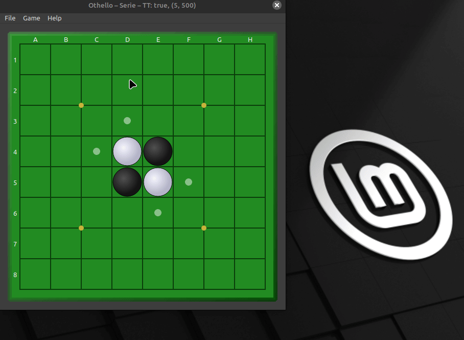

<!-- PROJECT SHIELDS -->
<p align="center">
  
  
  
  
  <a href="LICENSE"></a>
</p>

<h1 align="center">Othello</h1>

<p align="center">
  Qt6/C++ implementation of the Othello board game featuring a Negamax AI solver with alpha-beta pruning and optional OpenMP parallel benchmarking.
</p>

--------------------------------------------------

## Overview

This project is a desktop implementation of the classic **Othello** board game written in **C++17** using **Qt6**. It includes a graphical interface for playing the game as well as a solver capable of evaluating positions using a **Negamax search algorithm with alpha-beta pruning**.

The project also explores **parallel move evaluation using OpenMP**, allowing comparisons between serial and parallel search strategies. It was designed as an opportunity to experiment with game AI techniques, performance measurement and maintainable C++ architecture.

--------------------------------------------------

## Demo

### Gameplay



--------------------------------------------------

## Features

-   Playable **Othello GUI application** built with Qt6.
-   **Negamax AI** with **alpha-beta pruning** for efficient game-tree search.
-   **Transposition table** using **Zobrist hashing** to avoid recomputing positions.
-   **Parallel move evaluation** using **OpenMP** to benchmark speed improvements.
-   Built-in benchmarking tool to measure solver performance with and without OpenMP parallelization.

--------------------------------------------------

## Tech Stack

-   **Language:** C++17
-   **UI Framework:** Qt6 (Widgets / OpenGL)
-   **Build System:** CMake
-   **Parallelism:** OpenMP
-   **Testing:** CTest

--------------------------------------------------

## Getting Started

### Prerequisites

-   C++17 compatible compiler (GCC / Clang / MSVC)
-   CMake 3.16+
-   Qt6
-   OpenMP support

--------------------------------------------------

### Run Locally

#### 1. Clone the repository

``` bash
  git clone https://github.com/LeoPernier/Othello.git
  cd Othello
```

#### 2. Build the project

``` bash
  cmake -S . -B build -DCMAKE_BUILD_TYPE=Release
  cmake --build build -j
```

This produces the executables inside the `build/` directory.

#### 3. Run the Application

##### Run the graphical Othello game:

``` bash
  ./build/Othello
```

##### Run the Benchmark Tool

The repository includes a comparison tool used to measure the impact of OpenMP parallelization on the solver.

-   Run with default settings:

``` bash
  ./build/AutoCompare
```

-   Run with specify parameters:

``` bash
  ./build/AutoCompare 5 6 500
```

Arguments:

| Argument | Description                          |
|----------|--------------------------------------|
| games    | Number of games to simulate          |
| depth    | Solver search depth                  |
| time     | Maximum time per move (milliseconds) |

Example:

``` bash
  ./build/AutoCompare 5 6 500
```

Runs 5 games with search depth 6 and a maximum of 500 ms per move.

> **Note:** Each benchmark run generates CSV files with timing and performance metrics, allowing the results to be easily analyzed, plotted, or compared across different solver configurations.

##### Run the Tests

-   Board logic tests:

``` bash
  ./build/TestBoard
```

-   Solver tests:

``` bash
  ./build/TestSolver
```

--------------------------------------------------

## Project Structure

``` txt
  include/
   ├── Board.hpp                  # Board state, move validation and game rules
   ├── Solver.hpp                 # Negamax solver interface
   ├── OthelloWidget.hpp          # Main Qt game widget
   ├── PointsWidget.hpp           # Score display widget
   └── SolverSettingsDialog.hpp   # Solver configuration dialog

  src/
   ├── Main.cpp                   # GUI application entry point
   ├── Board.cpp                  # Board logic implementation
   ├── Solver.cpp                 # Negamax + alpha-beta + transposition table
   ├── OthelloWidget.cpp          # Main game window logic
   ├── PointsWidget.cpp           # Score display implementation
   └── AutoCompare.cpp            # Serial vs parallel benchmark tool

  tests/
   ├── TestBoard.cpp              # Board rules and move-generation tests
   ├── TestSolver.cpp             # Solver behavior tests
   └── TestUtils.hpp              # Shared test helpers

  assets/                         # Demo GIF and images
  graphiques/                     # Charts and plots used by Rapport.md
  test_results/                   # CSV benchmark outputs from AutoCompare

  CMakeLists.txt                  # Build configuration
  Rapport.md                      # Project report / analysis notes
  README.md
  LICENSE
```

--------------------------------------------------

## Design Notes

### 1) Game AI

The AI uses a **Negamax search algorithm** with **alpha-beta pruning**. This dramatically reduces the number of positions evaluated while maintaining optimal play.

### 2) Transposition Table

A **Zobrist hashing** scheme is used to uniquely identify board states and cache evaluations in a transposition table. This prevents recomputing previously explored positions.

### 3) Parallel Move Evaluation

Move scoring can optionally be parallelized with **OpenMP**, allowing independent branches of the search tree to be evaluated concurrently. A dedicated benchmarking executable allows measuring the real performance gains of this approach.

--------------------------------------------------

## License

Distributed under the MIT License. See `LICENSE` for more information.
